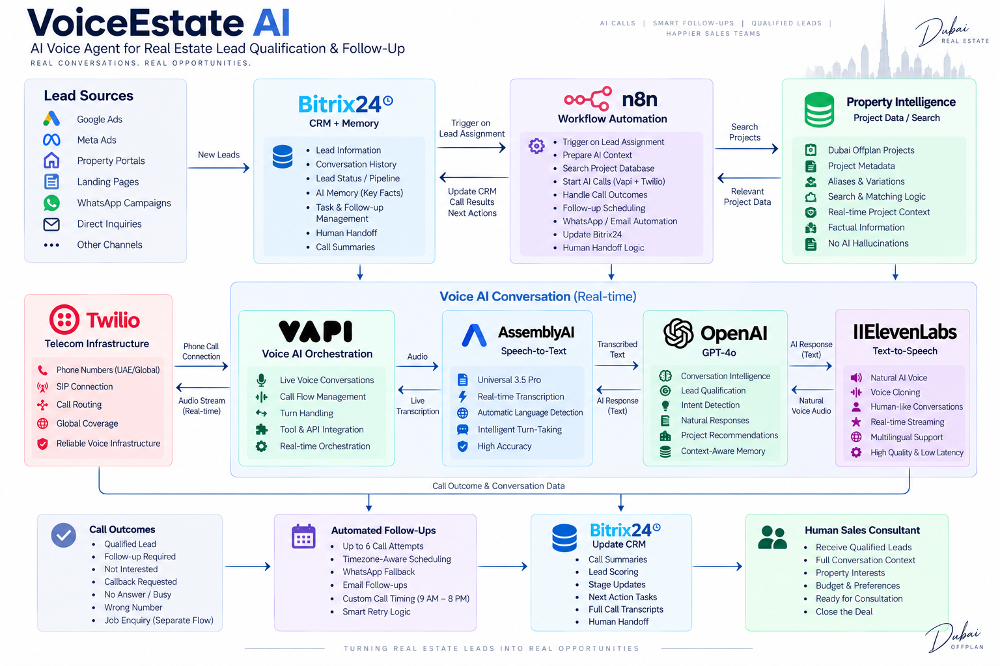

# VoiceEstate AI

### AI Voice Agent for Real Estate Lead Qualification & Follow-Up

VoiceEstate AI is an AI-powered voice agent built for real estate lead engagement and qualification.

It connects real-time phone conversations with CRM context, workflow automation, structured property intelligence, automated follow-ups, and human sales handoff.

The system is designed to **qualify and nurture leads — not replace the human closer.**

---

## 🎯 The Problem

Real estate leads can arrive from advertising campaigns, landing pages, property portals, and other acquisition channels.

The difficult part often begins after the lead arrives:

- Leads need to be contacted quickly.
- Many leads do not answer the first call.
- Requirements such as budget, purpose, location, and property preferences need to be understood.
- Follow-ups need to happen at appropriate times.
- Sales consultants need the previous conversation context before taking over.
- Property recommendations need to be based on real project information rather than AI-generated guesses.

VoiceEstate AI connects these pieces into one automated workflow.

---

## 🤖 What VoiceEstate AI Does

The system can:

- Engage real estate leads through AI phone calls
- Understand property requirements through natural conversation
- Identify investment vs. end-user intent
- Capture and confirm budget information
- Understand location and lifestyle preferences
- Resolve known project interests
- Search structured Dubai property project data
- Recommend relevant projects using available project information
- Maintain conversation memory between calls
- Schedule automated follow-up attempts
- Handle no-answer, callback, busy, and other call outcomes
- Update the CRM with conversation results
- Identify job/employment enquiries separately from property leads
- Escalate qualified opportunities to a human sales consultant

---

## 🧠 More Than a Voice Bot

VoiceEstate AI is not simply a voice interface.

The voice conversation is one component of a larger sales automation system:

```text
Lead
  ↓
CRM Context
  ↓
Workflow Orchestration
  ↓
AI Voice Conversation
  ↓
Qualification
  ↓
Property Intelligence
  ↓
CRM Memory
  ↓
Follow-Up
  ↓
Human Handoff
```

This allows the AI agent to operate as part of an actual lead-management workflow rather than as an isolated conversational demo.

---

## 🏗️ Architecture



### High-Level Flow

```text
                    LEAD SOURCES
        ┌───────────────────────────────────┐
        │ Meta Ads │ Google Ads │ Portals   │
        │ Landing Pages │ Other Campaigns   │
        └─────────────────┬─────────────────┘
                          │
                          ▼
                 ┌─────────────────┐
                 │    BITRIX24      │
                 │   CRM + MEMORY  │
                 └────────┬────────┘
                          │
                          ▼
                 ┌─────────────────┐
                 │       n8n       │
                 │  ORCHESTRATION  │
                 └───────┬─────────┘
                         │
              ┌──────────┴──────────┐
              │                     │
              ▼                     ▼
      ┌───────────────┐     ┌─────────────────┐
      │ Property Data │     │ Follow-Up Engine│
      │ / Project     │     │ Calls / Tasks   │
      │ Cache         │     │ / Messaging     │
      └───────┬───────┘     └─────────────────┘
              │
              ▼
       ┌───────────────┐
       │ Context Engine│
       │ Pre-call      │
       │ Context       │
       └───────┬───────┘
               │
               ▼
       ┌─────────────────────┐
       │        VAPI         │
       │   Voice Orchestration│
       └─────────┬───────────┘
                 │
          ┌──────┴─────────┐
          │                │
          ▼                ▼
   ┌─────────────┐  ┌──────────────┐
   │ AssemblyAI  │  │    GPT-4o    │
   │     STT     │  │ Conversation │
   │             │  │ Intelligence │
   └─────────────┘  └──────┬───────┘
                           │
                           ▼
                    ┌─────────────┐
                    │ ElevenLabs  │
                    │ AI Voice    │
                    └──────┬──────┘
                           │
                           ▼
                       Twilio
                           │
                           ▼
                    REAL PHONE CALL
                           │
                           ▼
                  CALL RESULT / CRM
                           │
                           ▼
                  HUMAN SALES HANDOFF
```

---

## 🧩 Technology Stack

| Layer | Technology | Responsibility |
|---|---|---|
| CRM | Bitrix24 | Lead data, operational memory, CRM updates |
| Automation | n8n | Workflow orchestration and business logic |
| Voice orchestration | Vapi | Real-time voice session management |
| Speech-to-text | AssemblyAI | Real-time speech recognition |
| Conversation AI | OpenAI GPT-4o | Conversation intelligence |
| Text-to-speech | ElevenLabs | AI voice generation |
| Telephony | Twilio | Phone connectivity |
| Property intelligence | Structured project data/cache | Factual project information |

---

## 🎙️ AssemblyAI Integration

AssemblyAI is integrated as the speech-to-text layer inside the Vapi voice pipeline.

### Current Configuration

- **Transcriber:** AssemblyAI Universal 3.5 Pro
- **Automatic language detection:** Enabled
- **Intelligent turn-taking:** Enabled

The integration allows spoken input from an actual phone conversation to be transcribed before the conversation is processed by GPT-4o.

### Voice Pipeline

```text
Lead speaks
    ↓
Twilio
    ↓
Vapi
    ↓
AssemblyAI
    ↓
GPT-4o
    ↓
ElevenLabs
    ↓
Vapi
    ↓
Twilio
    ↓
Lead
```

AssemblyAI handles speech recognition while Vapi continues to handle the live voice orchestration.

The integration has also been tested through an actual phone call rather than relying only on browser-based testing.

See:

[`docs/ASSEMBLYAI_INTEGRATION.md`](docs/ASSEMBLYAI_INTEGRATION.md)

---

## 🏢 CRM-Aware Conversations

Bitrix24 acts as the operational memory and CRM source of truth.

Before a call, the system can use available lead information such as:

- Lead name
- Country
- Project interest
- Budget
- Buying purpose
- Previous conversation context
- Follow-up information

The goal is to prevent the AI from treating every follow-up call as a completely new conversation.

---

## 🧠 AI Conversation Memory

VoiceEstate AI maintains AI conversation context between calls.

Previous conversation information can be supplied to the next voice session so the agent can continue naturally.

For example, if a lead already discussed their budget or project preference during an earlier conversation, the AI can use that context instead of repeatedly asking the same questions.

This is particularly important because the follow-up engine can make multiple contact attempts.

---

## 🏠 Property Intelligence

A core design principle is that the AI should **not invent property information**.

Project recommendations are supported by structured project data containing information such as:

- Project name
- Location
- Property type
- Bedrooms
- Budget / price information
- Developer
- Payment plan information
- Expected handover information
- Lifestyle attributes
- Project highlights

The system can resolve a known project or discover lead preferences first and then search for relevant projects.

```text
Known Project
     ↓
Project Resolution
     ↓
Structured Project Data
     ↓
AI Context
```

Or:

```text
No Specific Project
        ↓
Discover Preferences
        ↓
Budget / Area / Unit Type / Purpose / Timeline
        ↓
Project Search
        ↓
Relevant Project Context
```

The language model is therefore not treated as the source of truth for project facts.

---

## 📞 Lead Qualification

The AI acts as a property consultant rather than an aggressive salesperson.

The conversation can establish:

- Buying purpose
- Budget
- Location preference
- Property type
- Project interest
- Investment vs. end-user intent
- Interest level
- Buying timeline
- Callback preference

The agent is designed to keep conversations short, natural, and consultative.

It does not attempt to close the entire transaction.

---

## 🔄 Automated Follow-Up

Lead engagement does not end after one unanswered call.

The follow-up engine can manage multiple attempts while respecting defined timing rules.

Example cadence:

| Attempt | Follow-Up |
|---|---|
| 1 | Initial AI call |
| 2 | 3–4 hours later |
| 3 | Next day |
| 4 | 2 days later |
| 5 | 4 days later |
| 6 | 7 days later |
| After 6 | Stop and mark cold |

Calling times are calculated using the lead's local timezone and the configured calling window.

Selected follow-up events can also trigger automated messaging.

---

## 📊 Call Outcomes

The voice system can classify conversation outcomes such as:

```text
QUALIFIED
NOT_INTERESTED
NO_ANSWER
CALLBACK_REQUESTED
WRONG_NUMBER
PARTIAL
JOB_ENQUIRY
```

These outcomes are then handled by the surrounding automation workflow.

For example:

```text
Qualified
    ↓
Save Conversation Context
    ↓
Update CRM
    ↓
Human Sales Handoff
```

A job/employment enquiry can be separated from a genuine property lead rather than entering the normal property-sales workflow.

---

## 🤝 Human Handoff

VoiceEstate AI is designed around a **human-in-the-loop** sales model.

The AI handles:

1. Initial engagement
2. Qualification
3. Requirement discovery
4. Relevant project information
5. Follow-up
6. Conversation context

A human sales consultant handles the later sales process.

The human can receive relevant context such as:

- AI summary
- Budget
- Project interest
- Buying timeline
- Qualification information
- Conversation history

This means the human closer can continue the conversation with context already prepared.

---

## ⏱️ Time-Aware Calling

The system uses the lead's phone information to determine an appropriate local timezone.

Outbound calls are restricted to the configured calling window:

**9:00 AM – 8:00 PM local time**

If a lead is assigned outside the calling window, the system calculates the nearest feasible calling time rather than simply abandoning the attempt.

---

## 🔐 Security & Privacy

This public repository is intentionally sanitized.

It does **not** contain:

- API keys
- Access tokens
- CRM credentials
- Vapi credentials
- Twilio credentials
- ElevenLabs credentials
- Private webhook URLs
- Production phone numbers
- Customer/lead information
- Private production database contents

The repository documents the architecture and hackathon implementation without exposing production secrets or client data.

---

## 📂 Repository Structure

```text
voiceestate-ai/
│
├── README.md
├── architecture.png
│
├── docs/
│   ├── ASSEMBLYAI_INTEGRATION.md
│   ├── SYSTEM_ARCHITECTURE.md
│   └── DEMO_FLOW.md
│
└── .gitignore
```

### Documentation

- [`AssemblyAI Integration`](docs/ASSEMBLYAI_INTEGRATION.md)
- [`System Architecture`](docs/SYSTEM_ARCHITECTURE.md)
- [`Demo Flow`](docs/DEMO_FLOW.md)

---

## 🎬 Demo

The intended demo demonstrates the complete workflow:

```text
1. Lead enters / is assigned in CRM
              ↓
2. n8n receives the event
              ↓
3. Lead context is retrieved
              ↓
4. Appropriate call timing is calculated
              ↓
5. Vapi starts the outbound call
              ↓
6. AssemblyAI transcribes the lead
              ↓
7. GPT-4o generates the conversational response
              ↓
8. ElevenLabs generates the voice
              ↓
9. Lead is qualified
              ↓
10. Call outcome is processed
              ↓
11. CRM is updated
              ↓
12. Qualified lead is handed to a human
```

The demo is intended to show that the AI voice agent is connected to the surrounding sales workflow rather than functioning as a standalone chatbot.

---

## 🏆 Why This Architecture

The system deliberately separates responsibilities:

**Bitrix24**  
CRM and operational memory.

**n8n**  
Automation and business logic.

**Vapi**  
Real-time voice orchestration.

**AssemblyAI**  
Speech recognition.

**GPT-4o**  
Conversation intelligence.

**ElevenLabs**  
Voice generation.

**Twilio**  
Telephony.

**Property Intelligence**  
Structured source of project facts.

This separation makes the system easier to reason about, test, extend, and maintain.

---

## 🎯 Project Philosophy

The goal is not to build an AI that simply talks.

The goal is to build an AI that can participate meaningfully in a real sales workflow.

```text
Good Voice AI
      +
CRM Context
      +
Automation
      +
Reliable Property Data
      +
Persistent Memory
      +
Human Handoff
      =
Useful Sales System
```

The AI handles repetitive engagement and qualification so human sales consultants can spend more time on genuinely interested opportunities.

---

## 🚧 Current Status

The core voice-agent workflow is operational and has been tested through real phone calls.

The public repository focuses on documenting the architecture, AssemblyAI integration, workflow design, and demo flow without exposing the underlying production environment.

Future development can extend the system with additional integrations, languages, intelligence, and automation while preserving the same separation of responsibilities.

---

## 📜 Hackathon Note

VoiceEstate AI was prepared as a public-facing implementation for the **AssemblyAI Voice Agent Hackathon**.

The repository is intentionally focused on demonstrating the architecture, integration approach, and system design rather than publishing the private production infrastructure.

---

## 👤 Author

**Muhammad Khalid Makki**

Digital Marketing Strategist & AI Automation Builder

Building practical AI systems that connect automation, data, and real-world business workflows.
